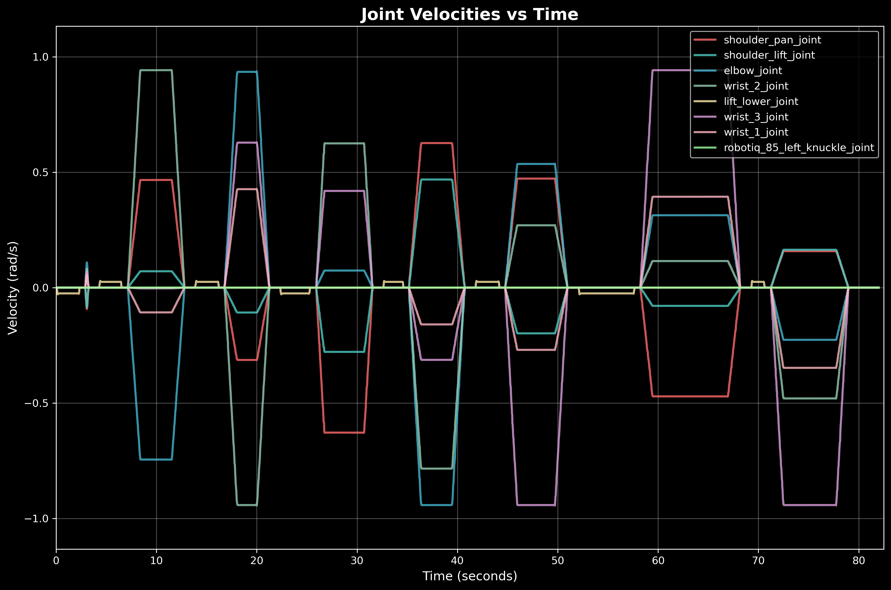
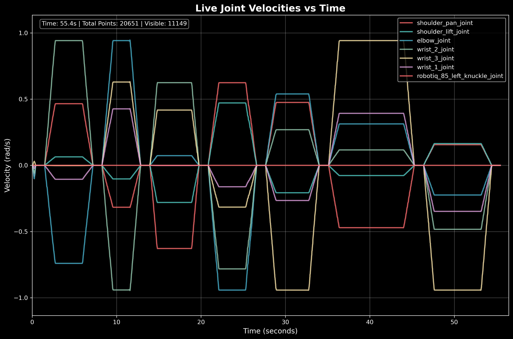

# Assignment Report: Robot Manipulation Setup with Docker and MoveIt

## Setup Overview

### Docker Environment

The development environment was containerized using Docker. Since I had recently swtiched to Arch
linux(running wayland), I spent a lot of time trying to get the display forwarding to work. Since
I could not succeed it that, I switched to x11 which worked with a few flags 
```
    --env="DISPLAY=$DISPLAY" \
    --env="QT_X11_NO_MITSHM=1" \
    --volume="/tmp/.X11-unix:/tmp/.X11-unix:rw" \
    --volume="$HOME/.Xauthority:/root/.Xauthority:rw" \
    --network host \
```

### Universal Robots Integration

Universal Robots drivers *ros-humble-ur* were integrated with the Gazebo simulation environment to provide realistic robot behavior and control interfaces.
I have also use the description files from the *ros2_robotiq_gripper* for the 2f_85 gripper.


### Ewellix Lifts

The Ewellix lift is integrated into the simulation to provide vertical motion for the robot's workspace. The lift is controlled via MoveIt2 action interfaces, allowing the robot to adjust its height dynamically during task execution. In the code, the lift is treated as a separate joint group, and its position is set independently from the main manipulator. This enables the robot to draw shapes or reach different levels by commanding the lift to specific heights before executing Cartesian paths with the end-effector. 

### Packages Used

 - ur_description for the meshes and urdf of the arm
 - robotiq_description for the meshed and urdf of the gripper
 - ewellix_description for the lift
 - moveit_ros_planning_interface

### Images/Videos


<video width="100%" controls>
  <source src="docs/assets/sim.mp4" type="video/mp4">
</video>





### MoveIt Configuration

Two distinct move groups were configured within the MoveIt framework:
Please refer [Moveit Config](moveit_config/) for more details
about joint, virtual joints, links, move groups etc.

1. **Lift Move Group**: Configured to control vertical lifting mechanisms
2. **UR10e Move Group**: Configured to control the Universal Robots UR10e manipulator arm
3. **Robotiq Move Group**: Configure to control the gripper


### Launch

```
ros2 launch simulation_10x moveit_ur10e.launch.py
```

### Trapezoidal Velocity Profile 

I have use the pliz_industrial_motion_planner [For more info](https://moveit.picknik.ai/main/api/html/classpilz__industrial__motion__planner_1_1VelocityProfileATrap.html)

### Constant-Velocity Cartesian Motion

I attempted to implement constant-velocity Cartesian motion for drawing shapes using the [Pilz Industrial Motion Planner](https://moveit.picknik.ai/humble/doc/examples/pilz_industrial_motion_planner/pilz_industrial_motion_planner.html#the-lin-motion-command). The goal was to achieve smooth, linear motion between waypoints with consistent velocity profiles.

However, the implementation in `cartesian_shape_drawer.py` faced several challenges:

1. **Non-Linear Movement**: Despite using the LIN motion command, the generated trajectories did not follow perfectly linear paths between waypoints. The robot is not moving linearly.

2. **Pilz Planner Integration Issues**: The Pilz industrial motion planner integration was not working as expected. The LIN motion command, which should provide linear Cartesian trajectories, failed

The `cartesian_shape_drawer.py` script attempts to use the LIN planner for linear motion between waypoints, but the actual robot movement deviates from the intended linear paths. This limitation makes it challenging to achieve precise constant-velocity Cartesian motion

As an alternative approach, I implemented a different strategy in `move_robot_positions.py` that focuses on joint-space motion planning with predefined positions, which provides more predictable and reliable motion execution.


